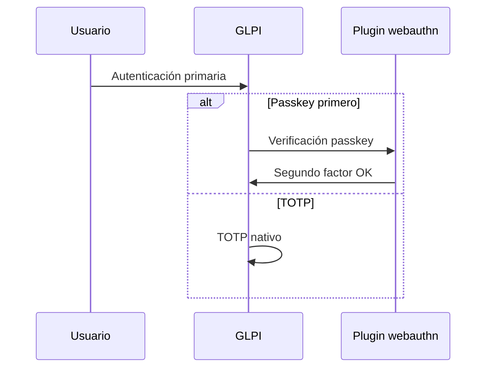

# Arquitectura

El plugin añade WebAuthn al segundo factor de GLPI 11 sin modificar el núcleo: sesión, hooks y controladores propios.

## Flujo de login

## Componentes

| Componente | Función |
|------------|---------|
| PluginWebauthnConfig | Configuración |
| PluginWebauthnCredential | Passkeys y UI |
| PluginWebauthnProfile | Políticas por perfil |
| WebAuthnService | Registro y autenticación |
| ChallengeStore | Challenge en sesión |
| CredentialRepository | Persistencia |
| PolicyService | Reglas de modo y perfil |
| RequestBridge | Integración login y MFA |

## Rutas HTTP

Prefijo: directorio web del plugin en GLPI.

| Método | Ruta | Uso |
|--------|------|-----|
| POST | /register/options | Inicio de registro |
| POST | /register/verify | Fin de registro |
| POST | /auth/options | Inicio de autenticación |
| POST | /auth/verify | Fin de autenticación |
| GET | /auth/prompt | Pantalla de verificación passkey |
| GET/POST | /credentials | Listado y revocación |

## Base de datos

| Tabla | Contenido |
|-------|-----------|
| glpi_plugin_webauthn_config | Parámetros |
| glpi_plugin_webauthn_credentials | Passkeys |
| glpi_plugin_webauthn_profiles | Flags por perfil |

## Cliente

`public/webauthn.js`: registro, autenticación e integración con login y preferencias. Peticiones con token CSRF de GLPI.

## Biblioteca

web-auth/webauthn-lib 5.x (PHP 8.2+).
