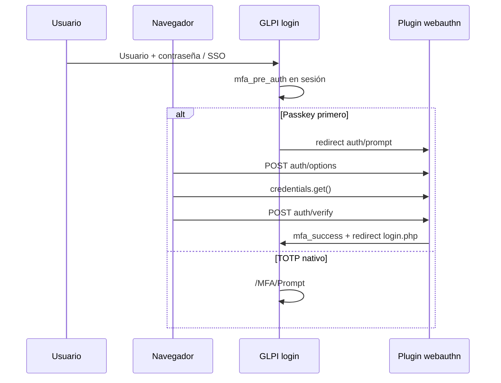

# Arquitectura técnica

## Resumen

El plugin añade una capa **WebAuthn** sobre el MFA ya existente en GLPI 11. No modifica el core de GLPI; usa sesión, hooks y controladores de plugin.

## Componentes principales

| Componente | Rol |
|------------|-----|
| `PluginWebauthnConfig` | Configuración clave-valor en BD |
| `PluginWebauthnCredential` | CRUD lógico de passkeys, pestañas UI |
| `PluginWebauthnProfile` | Políticas por perfil |
| `WebAuthnService` | Ceremonias de registro y autenticación |
| `ChallengeStore` | Challenge temporal en sesión |
| `CredentialRepository` | Persistencia + adaptador webauthn-lib |
| `PolicyService` | Reglas por perfil y modo |
| `RequestBridge` | Hook post_init, botón login |
| Controladores `src/Controller/*` | API REST del plugin |

## Rutas HTTP (GLPI 11)

Prefijo: `{Plugin::getWebDir('webauthn')}` → `/plugins/webauthn`.

| Método | Ruta | Uso |
|--------|------|-----|
| POST | `/register/options` | Inicio registro (autenticado) |
| POST | `/register/verify` | Fin registro |
| POST | `/auth/options` | Inicio login passkey |
| POST | `/auth/verify` | Fin login passkey |
| GET | `/auth/prompt` | Pantalla MFA passkey |
| GET/POST | `/credentials` | Listado / revocación |

El registro de passkeys requiere sesión autenticada. La autenticación con passkey en login usa sesión PHP para enlazar las peticiones `options` y `verify`.

## Integración MFA GLPI

- `plugin_webauthn_post_init` detecta `/MFA/Prompt` con `mfa_pre_auth` y redirige al prompt del plugin si aplica.
- Tras verificación exitosa se setea `$_SESSION['mfa_success'] = true` y se redirige a `front/login.php` como hace el flujo TOTP nativo.

## Base de datos

| Tabla | Contenido |
|-------|-----------|
| `glpi_plugin_webauthn_config` | Configuración (`k`, `v`) |
| `glpi_plugin_webauthn_credentials` | Passkeys (credential_id, clave pública, contador, user_handle, …) |
| `glpi_plugin_webauthn_profiles` | Flags por perfil |

## Cliente JavaScript

`public/webauthn.js` — funciones `register`, `authenticate`, delegación de clicks para pestañas AJAX y login. Usa `fetch` con cabeceras exigidas por GLPI 11 (`X-Requested-With`, `X-Glpi-Csrf-Token`).

## Dependencia externa

[web-auth/webauthn-lib](https://github.com/web-auth/webauthn-lib) v5.x (PHP 8.2+, Symfony serializer).
